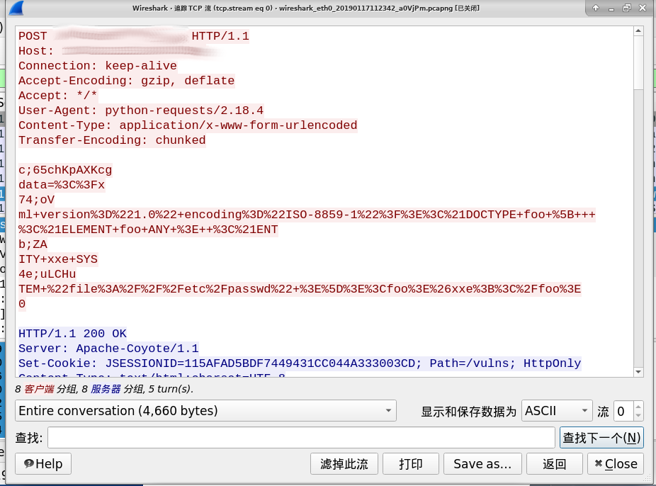

# ChunkedHTTPAdapter
## 说明

参考文章[《利用分块传输吊打所有WAF》](https://www.anquanke.com/post/id/169738)所提供的方法，继承改写了requests默认的HTTPAdapter，使其能自动将request body改为Chunked形式并添加随机注释，不必自己实现迭代器。

支持data参数和files参数(仍然可以给data参数传产生器,有随机注释)。

可设置必须分割的关键词，用来绕过WAF的关键词检测(大小写敏感)。

在python2下进行编写，简单的适配了python3。

详细使用参考test.py

具体效果可以使用Wireshark抓包，查看TCP流:

## 参考：

1. Requests 高级用法 块编码请求

http://docs.python-requests.org/zh_CN/latest/user/advanced.html#chunk-encoding
2. 利用分块传输吊打所有WAF

https://www.anquanke.com/post/id/169738

